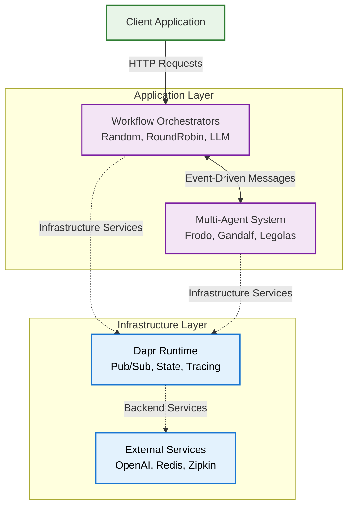
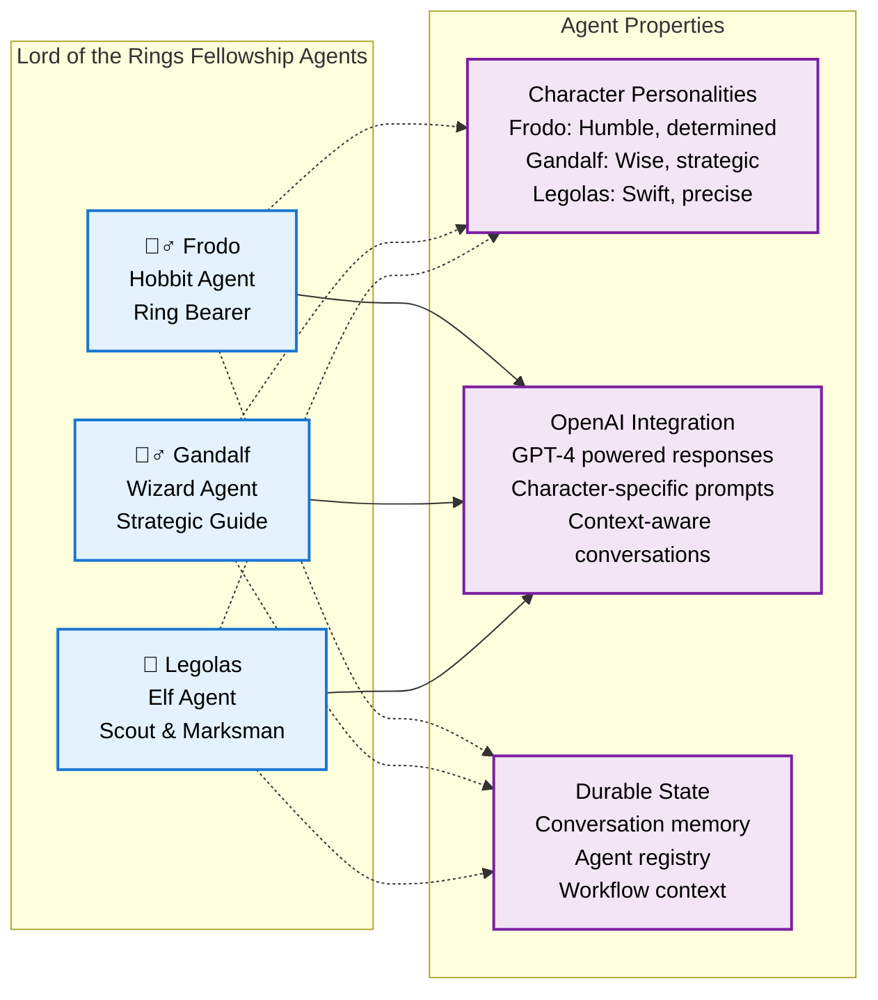
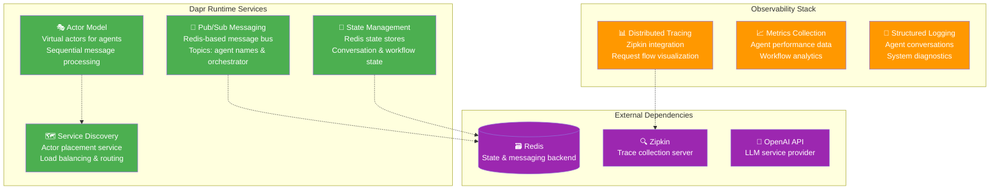
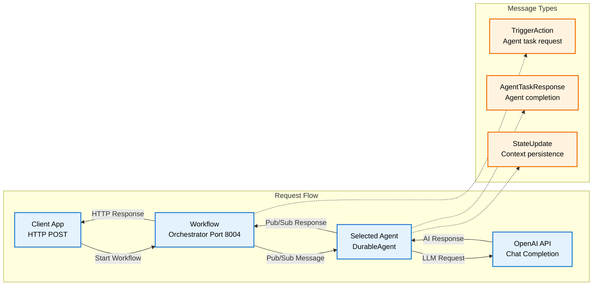
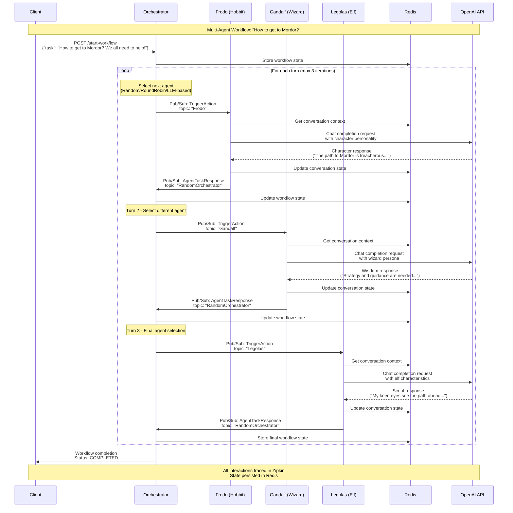

# Multi-Agent Event-Driven Workflows
This quickstart demonstrates how to create and orchestrate event-driven workflows with multiple autonomous agents using Dapr Agents. You'll learn how to set up agents as services, implement workflow orchestration, and enable real-time agent collaboration through pub/sub messaging.

## Prerequisites
- Python 3.10 (recommended)
- pip package manager
- OpenAI API key
- Dapr CLI and Docker installed

## Environment Setup

### Using UV (Recommended)

```bash
# Create and activate virtual environment
uv venv .venv
source .venv/bin/activate

# Install dependencies
uv pip install -r requirements.txt
```

### Alternative: Using pip

```bash
# Create a virtual environment
python -m venv .venv

# Activate the virtual environment
# On Windows:
.venv\Scripts\activate
# On macOS/Linux:
source .venv/bin/activate

# Install dependencies
pip install -r requirements.txt
```

## Configuration

1. Create a `.env` file for your API keys:

```env
OPENAI_API_KEY=your_api_key_here
```

2. Make sure Dapr is initialized on your system:

```bash
dapr init
```

3. The quickstart includes the necessary Dapr components in the `components` directory:

- `statestore.yaml`: Agent state configuration
- `pubsub.yaml`: Pub/Sub message bus configuration
- `workflowstate.yaml`: Workflow state configuration

## Architecture Overview

### High-Level System Architecture



### Detailed Component Diagrams

#### 1. Multi-Agent System Components



#### 2. Workflow Orchestration Strategies

```mermaid
graph LR
    subgraph Random ["🎲 Random Orchestrator"]
        R1[Randomly selects agents]
        R2[Equal probability for all]
        R3[Good for: Load balancing]
        R4[Pattern: Unpredictable]
    end

    subgraph RoundRobin ["🔄 RoundRobin Orchestrator"]  
        RR1[Sequential agent selection]
        RR2[Cycles through all agents]
        RR3[Good for: Fair distribution]
        RR4[Pattern: Agent A → B → C → A]
    end

    subgraph LLM ["🧠 LLM Orchestrator"]
        L1[AI-powered selection]
        L2[Analyzes conversation context]
        L3[Good for: Context-aware routing]
        L4[Pattern: Best agent for task]
    end

    Random -.->|"selects from"| Agents[Frodo, Gandalf, Legolas]
    RoundRobin -.->|"cycles through"| Agents
    LLM -.->|"intelligently picks"| Agents

    classDef random fill:#ffebee,stroke:#c62828,stroke-width:2px,color:#000
    classDef roundrobin fill:#e3f2fd,stroke:#1976d2,stroke-width:2px,color:#000
    classDef llm fill:#e8f5e8,stroke:#2e7d32,stroke-width:2px,color:#000
    classDef agents fill:#fff3e0,stroke:#ef6c00,stroke-width:2px,color:#000

    class R1,R2,R3,R4 random
    class RR1,RR2,RR3,RR4 roundrobin
    class L1,L2,L3,L4 llm
    class Agents agents
```

#### 3. Dapr Infrastructure Components



#### 4. Communication Flow Patterns



## Workflow Execution Flow



## Project Structure

```
components/               # Dapr configuration files
├── statestore.yaml       # State store configuration
├── pubsub.yaml           # Pub/Sub configuration
└── workflowstate.yaml    # Workflow state configuration
services/                 # Directory for agent services
├── hobbit/               # First agent's service
│   └── app.py            # FastAPI app for hobbit
├── wizard/               # Second agent's service
│   └── app.py            # FastAPI app for wizard
├── elf/                  # Third agent's service
│   └── app.py            # FastAPI app for elf
└── workflow-random/      # Workflow orchestrator
    └── app.py            # Workflow service
└── workflow-roundrobin/  # Roundrobin orchestrator
    └── app.py            # Workflow service    
└── workflow-llm/         # LLM orchestrator
    └── app.py            # Workflow service        
dapr-random.yaml          # Multi-App Run Template using the random orchestrator
dapr-roundrobin.yaml      # Multi-App Run Template using the roundrobin orchestrator
dapr-llm.yaml             # Multi-App Run Template using the LLM orchestrator
```

## Examples

### Agent Service Implementation

Each agent is implemented as a separate service. Here's an example for the Hobbit agent:

```python
from dapr_agents import Agent, DurableAgent
from dotenv import load_dotenv
import asyncio
import logging

async def main():
    try:
        hobbit_service = DurableAgent(
          name="Frodo",
          role="Hobbit",
          goal="Carry the One Ring to Mount Doom, resisting its corruptive power while navigating danger and uncertainty.",
          instructions=[
              "Speak like Frodo, with humility, determination, and a growing sense of resolve.",
              "Endure hardships and temptations, staying true to the mission even when faced with doubt.",
              "Seek guidance and trust allies, but bear the ultimate burden alone when necessary.",
              "Move carefully through enemy-infested lands, avoiding unnecessary risks.",
              "Respond concisely, accurately, and relevantly, ensuring clarity and strict alignment with the task."],
          message_bus_name="messagepubsub",
          state_store_name="workflowstatestore",
          state_key="workflow_state",
          agents_registry_store_name="agentstatestore",
          agents_registry_key="agents_registry",
          broadcast_topic_name="beacon_channel",
        )

        await hobbit_service.start()
    except Exception as e:
        print(f"Error starting service: {e}")

if __name__ == "__main__":
    load_dotenv()
    logging.basicConfig(level=logging.INFO)
    asyncio.run(main())
```

Similar implementations exist for the Wizard (Gandalf) and Elf (Legolas) agents.

### Workflow Orchestrator Implementations

The workflow orchestrators manage the interaction between agents. Currently, Dapr Agents support three workflow types: RoundRobin, Random, and LLM-based. Here's an example for the Random workflow orchestrator (you can find examples for RoundRobin and LLM-based orchestrators in the project):

```python
from dapr_agents import RandomOrchestrator
from dotenv import load_dotenv
import asyncio
import logging

async def main():
    try:
        random_workflow_service = RandomOrchestrator(
            name="RandomOrchestrator",
            message_bus_name="messagepubsub",
            state_store_name="agenticworkflowstate",
            state_key="workflow_state",
            agents_registry_store_name="agentstatestore",
            agents_registry_key="agents_registry",
            max_iterations=3
        ).as_service(port=8004)
        await random_workflow_service.start()
    except Exception as e:
        print(f"Error starting service: {e}")

if __name__ == "__main__":
    load_dotenv()
    logging.basicConfig(level=logging.INFO)
    asyncio.run(main())
```

### Running the Multi-Agent System

The project includes three dapr multi-app run configuration files (`dapr-random.yaml`, `dapr-roundrobin.yaml` and `dapr-llm.yaml` ) for running all services and an additional Client application for interacting with the agents:

Example: `dapr-random.yaml`
```yaml
version: 1
common:
  resourcesPath: ./components
  logLevel: info
  appLogDestination: console
  daprdLogDestination: console

apps:
- appID: HobbitApp
  appDirPath: ./services/hobbit/
  command: ["python3", "app.py"]

- appID: WizardApp
  appDirPath: ./services/wizard/
  command: ["python3", "app.py"]

- appID: ElfApp
  appDirPath: ./services/elf/
  command: ["python3", "app.py"]

- appID: WorkflowApp
  appDirPath: ./services/workflow-random/
  command: ["python3", "app.py"]
  appPort: 8004

- appID: ClientApp
  appDirPath: ./services/client/
  command: ["python3", "http_client.py"]
```

Start all services using the Dapr CLI:

<!-- STEP
name: Run text completion example
match_order: none
expected_stdout_lines:
  - "Workflow started successfully!"
  - "user:"
  - "How to get to Mordor? We all need to help!"
  - "assistant:"
  - "user:"
  - "assistant:"
  - "workflow completed with status 'ORCHESTRATION_STATUS_COMPLETED' workflowName 'RandomWorkflow'"
timeout_seconds: 120
output_match_mode: substring
background: false
sleep: 5
-->
```bash
dapr run -f dapr-random.yaml 
```
<!-- END_STEP -->

You will see the agents engaging in a conversation about getting to Mordor, with different agents contributing based on their character.

You can also run the RoundRobin and LLM-based orchestrators using `dapr-roundrobin.yaml` and `dapr-llm.yaml` respectively:

<!-- STEP
name: Run text completion example
match_order: none
expected_stdout_lines:
  - "Workflow started successfully!"
  - "user:"
  - "How to get to Mordor? We all need to help!"
  - "assistant:"
  - "user:"
  - "assistant:"
  - "workflow completed with status 'ORCHESTRATION_STATUS_COMPLETED' workflowName 'RoundRobinWorkflow'"
timeout_seconds: 120
output_match_mode: substring
background: false
sleep: 5
-->
```bash
dapr run -f dapr-roundrobin.yaml 
```
<!-- END_STEP -->

<!-- STEP
name: Run text completion example
match_order: none
expected_stdout_lines:
  - "Workflow started successfully!"
  - "user:"
  - "How to get to Mordor? We all need to help!"
  - "assistant:"
  - "user:"
  - "assistant:"
  - "workflow completed with status 'ORCHESTRATION_STATUS_COMPLETED' workflowName 'LLMWorkflow'"
timeout_seconds: 200
output_match_mode: substring
background: false
-->
```bash
dapr run -f dapr-llm.yaml 
```
<!-- END_STEP -->
**Expected output:** The agents will engage in a conversation about getting to Mordor, with different agents contributing based on their character. Observe that in the logs, or checking the workflow state in [Redis Insights](https://dapr.github.io/dapr-agents/home/installation/#enable-redis-insights).

## Key Concepts
- **Agent Service**: Stateful service exposing an agent via API endpoints with independent lifecycle management
- **Pub/Sub Messaging**: Event-driven communication between agents for real-time collaboration
- **State Store**: Persistent storage for both agent registration and conversational memory
- **Actor Model**: Self-contained, sequential message processing via Dapr's Virtual Actor pattern
- **Workflow Orchestration**: Coordinating agent interactions in a durable and resilient manner

## Workflow Types
Dapr Agents supports multiple workflow orchestration patterns:

1. **RoundRobin**: Cycles through agents sequentially, ensuring equal task distribution
2. **Random**: Selects agents randomly for tasks, useful for load balancing and testing
3. **LLM-based**: Uses an LLM (default: OpenAI's models like gpt-4o) to intelligently select agents based on context and task requirements

## Monitoring and Observability
1. **Console Logs**: Monitor real-time workflow execution and agent interactions
2. **Dapr Dashboard**: View components, configurations and service details at http://localhost:8080/
3. **Zipkin Tracing**: Access distributed tracing at http://localhost:9411/zipkin/
4. **Dapr Metrics**: Access agent performance metrics via (ex: HobbitApp) http://localhost:6001/metrics when configured

## Troubleshooting

1. **Service Startup**: If services fail to start, verify Dapr components configuration
2. **Communication Issues**: Check Redis connection and pub/sub setup
3. **Workflow Errors**: Check Zipkin traces for detailed request flows
4. **Port Conflicts**: If ports are already in use, check which port is already in use
5. **System Reset**: Clear Redis data through Redis Insights if needed

## Next Steps

After completing this quickstart, you can:

- Add more agents to the workflow
- Switch to another workflow orchestration pattern (RoundRobin, LLM-based)
- Extend agents with custom tools
- Deploy agents and Dapr to a Kubernetes cluster. For more information on read [Deploy Dapr on a Kubernetes cluster](https://docs.dapr.io/operations/hosting/kubernetes/kubernetes-deploy)
- Check out the [Cookbooks](../../cookbook/)